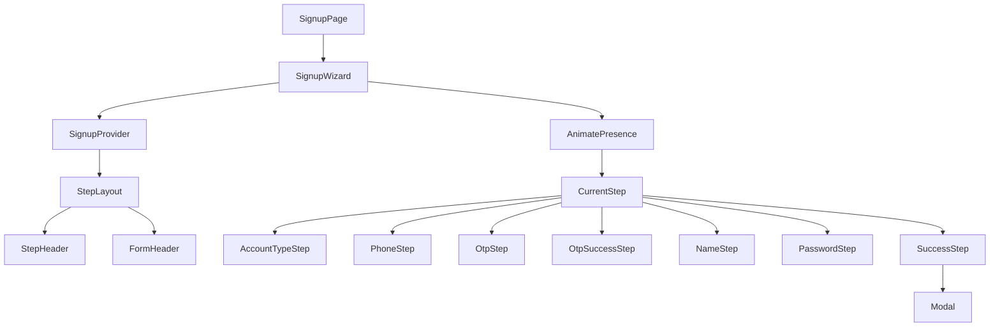
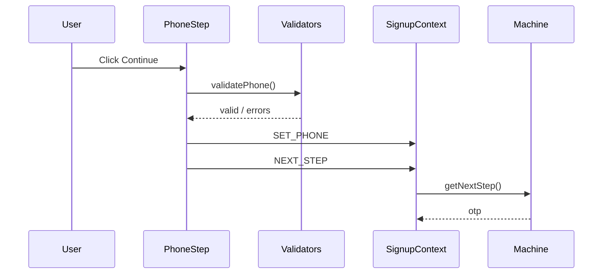

# Root Pay — Signup Flow (Figma Take-Home)

A multi-step fintech signup wizard built with React 19, TypeScript, and Vite. The layout and responsive behavior extended with Context-based state, accessibility, and (OTP success interstitial, success modal).

## Live demo

**Repository:** [github.com/chinmaynawkar/figma-login-flow](https://github.com/chinmaynawkar/figma-login-flow)

**Deployed URL:** _Complete [Vercel import](https://vercel.com/new/clone?repository-url=https://github.com/chinmaynawkar/figma-login-flow) (see below), then paste your production URL here._

[](https://vercel.com/new/clone?repository-url=https://github.com/chinmaynawkar/figma-login-flow)

### Deploy on Vercel (one-time)

1. Click **Deploy with Vercel** above (or [import the repo](https://vercel.com/new/clone?repository-url=https://github.com/chinmaynawkar/figma-login-flow)).
2. Framework preset: **Vite** (auto-detected). Build: `npm run build`, output: `dist`.
3. Add environment variable: `VITE_APP_ENV` = `production`.
4. Deploy. `vercel.json` already configures SPA rewrites for `/signup`.

## Screenshots

_Add screenshots or a GIF of the full flow here._

---

## Getting started

```bash
npm install
npm run dev
```

Open [http://localhost:5173/signup](http://localhost:5173/signup).

```bash
npm run build
npm run lint
npm run preview
```

---

## Architecture

This app is a **linear wizard**: one route (`/signup`), one feature module (`features/signup`), and a small set of reusable UI primitives. There is no backend; async steps simulate network delay with timeouts.

### Layering

| Layer          | Responsibility                                                             |
| -------------- | -------------------------------------------------------------------------- |
| **Pages**      | `SignupPage` mounts the wizard                                             |
| **Features**   | `SignupWizard` orchestrates steps; `SignupContext` holds form + step index |
| **Components** | Presentational UI (`Button`, `Input`, `StepLayout`, …)                     |
| **Lib**        | Pure validators, constants, `runAsyncStep` helper                          |
| **Styles**     | Design tokens, global reset, Framer `pageVariants`, a11y focus rings       |

### Folder structure

```
src/
├── pages/SignupPage.tsx
├── features/signup/
│   ├── SignupWizard.tsx      # AnimatePresence + step switch
│   ├── SignupContext.tsx     # useReducer + Provider
│   ├── signupMachine.ts      # next/prev/progress
│   └── steps/                # One file per screen
├── components/
│   ├── ui/                   # Button, Input, OtpInput, PasswordInput, Modal
│   ├── layout/               # StepLayout, StepHeader, ProgressBar
│   └── shared/               # AccountTypeCard, PhoneDialCode
├── lib/validators.ts
├── lib/constants.ts
├── lib/runAsyncStep.ts
├── styles/animations.ts
└── types/signup.ts
```

### Component hierarchy



### State machine

`SignupStep` enum drives navigation (7 values):

```
accountType → phone → otp → otpSuccess → name → password → success
```

- **State** lives in `SignupContext` (`useReducer`): current step + all field values.
- **Transitions** are defined in `signupMachine.ts` (`getNextStep`, `getPrevStep`, `getStepProgress`).
- **Steps** dispatch `SET_*` actions on continue, then `NEXT_STEP`. Back uses `PREV_STEP`.
- **Validation** runs in step components via pure functions in `validators.ts` (errors shown on continue, not on every keystroke—except password strength bar).

### Data flow (single step)



### Animations

- **Step content:** `AnimatePresence mode="wait"` in `SignupWizard` with `pageVariants` (`src/styles/animations.ts`) — slide in from right (x: 40), exit left (x: -40).
- **Progress bar:** Framer Motion width animation (0.4s ease) in `ProgressBar`.

---

## Design decisions

### Why SCSS Modules + Tailwind?

- **SCSS modules** per component (`Button.module.scss`, `StepLayout.module.scss`) keep styles colocated and avoid global classname collisions. Design tokens live in `tokens.scss` as CSS variables.
- **Tailwind** is available for utilities where helpful; the reference layout was ported primarily with SCSS to match Figma spacing and breakpoints precisely.

### Why React Context instead of Redux?

The flow is strictly linear: no unrelated global consumers, no time-travel debugging requirement, and a single form object. `useReducer` in `SignupProvider` is enough and keeps boilerplate low.

### Why pure validator functions (no Zod)?

Validators are synchronous, small, and easy to unit test without a renderer. The assessment spec lists explicit rules (10-digit IN phone, 4-digit OTP, password complexity); functions map 1:1 to those rules.

### Why a custom Modal instead of `reactjs-popup`?

The reference used `reactjs-popup`. We replaced it with a Framer Motion overlay (`Modal.tsx`) for consistent enter/exit animation and full control of padding, focus, and `aria-labelledby`.

### Layout: static left panel + per-step form titles

Matches reference `OnboardingLayout`:

- **Left (lg+ only):** “Let's get started” + “Create your account” + hero illustration.
- **Right form card:** Step-specific heading at `1.25rem` (e.g. “Enter your mobile number”). Password requirements appear only under the password field (`PasswordInput` hint + strength bar), not duplicated in the form header subtitle.

### Responsive layout (reference-aligned)

Breakpoints match the reference Tailwind setup:

| Viewport                   | Behavior                                                                                                           |
| -------------------------- | ------------------------------------------------------------------------------------------------------------------ |
| **&lt; 640px (mobile)**    | Full-width form card, no left panel, no background image, stacked nav buttons full width                           |
| **640px – 1023px (sm/md)** | Centered card `max-width: 580px`, rounded shadow, background visible, still no left panel                          |
| **≥ 1024px (lg)**          | Split layout: left brand + hero (`flex-1`), right form fixed `708px`, card `max-width: 1280px`, `overflow: hidden` |

Other reference practices preserved: progress bar 80% width, button max-width `250px` on sm+, input height `44px`, primary `#0054fd`.

### Async / loading pattern

`runAsyncStep` wraps mock API calls: shows button spinner, and if the action exceeds **3 seconds**, surfaces an inline timeout error (network mock).

---

## Tech stack

| Technology            | Role                                  |
| --------------------- | ------------------------------------- |
| React 19 + TypeScript | UI + strict typing                    |
| Vite 8                | Dev server & build                    |
| Framer Motion         | Step transitions, progress bar, modal |
| React Router 7        | `/signup` + redirects                 |
| SCSS Modules          | Component styles + tokens             |
| lucide-react          | Icons                                 |

---

## Enhancements beyond reference

- OTP resend countdown (30s)
- Password strength indicator
- OTP success interstitial with SVG animation
- Accessibility: `aria-*`, `role="alert"`, focus-visible, label/`id` pairing
- Seven-step machine including `otpSuccess` and `success` modal step
- `runAsyncStep` timeout handling

---

## Environment

| Variable       | Description                             |
| -------------- | --------------------------------------- |
| `VITE_APP_ENV` | Optional; set to `production` on Vercel |

---

## License

Private assessment project.
